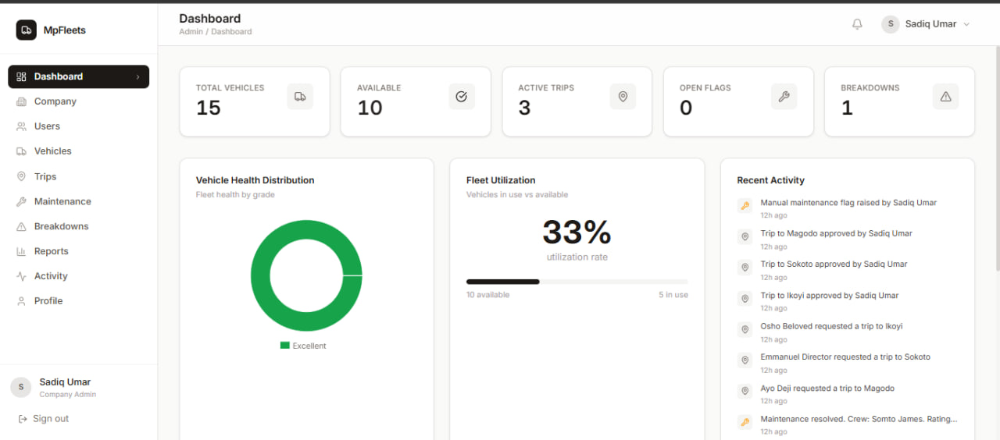
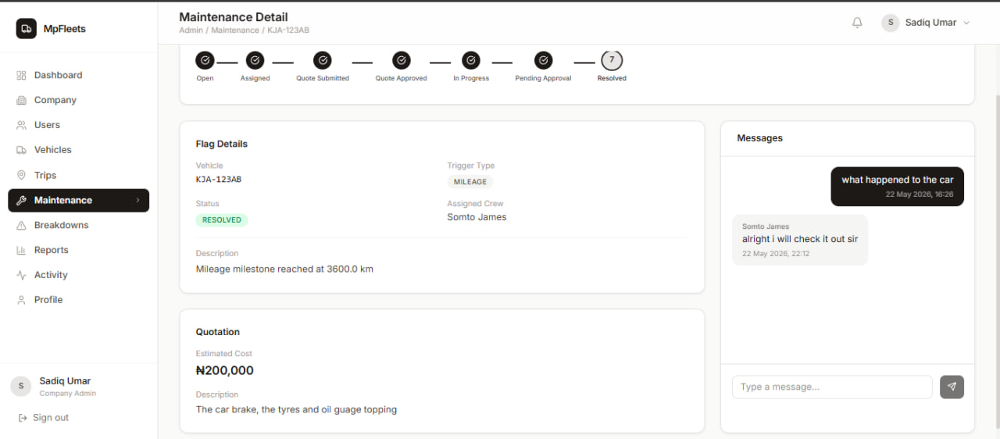

# MpFleet — Fleet Management System

> **Fleet operations, without the chaos.**

MpFleet is a role-based fleet management platform that replaces WhatsApp messages, phone calls, and paper records with one structured, auditable system. Fleet managers approve trips, track vehicle health, manage maintenance workflows, and respond to breakdowns — all from a single dashboard.

---

## Screenshots

<p align="center">
  
  
</p>
---

## What it does

MpFleet connects four stakeholders in one platform:

| Role | What they can do |
| :--- | :--- |
| **Platform Admin** | Provision companies, cross-fleet oversight, activity monitoring |
| **Fleet Manager** | Register vehicles, approve trips, assign maintenance, view reports |
| **Field Staff** | Browse available vehicles, submit trip requests, report breakdowns, log mileage |
| **Maintenance Crew** | Work flagged maintenance tickets, submit quotes, update progress |

**Core workflows:**

- **Trip management** — field staff request trips; managers approve or reject; vehicles automatically lock to `ASSIGNED` on approval
- **Automated maintenance flagging** — when a mileage log crosses a service threshold, the system fires a Kafka event and creates a maintenance flag without any manual input
- **Maintenance workflow** — 7-stage tracked process: Open → Assigned → Quote Submitted → Quote Approved → In Progress → Pending Approval → Resolved, with a real-time message thread between the manager and crew on every flag
- **Breakdown response** — field staff report incidents; managers coordinate response through the same auditable record

---

## Tech Stack

### Frontend

| Technology | Purpose |
| :--- | :--- |
| React 19 + Vite | UI and build tooling |
| Redux Toolkit + RTK Query | State management and data fetching with auto-caching (16 tag types) |
| redux-persist | Persists auth state across page refreshes |
| Tailwind CSS v4 | Utility-first styling |
| Radix UI | Accessible component primitives |
| Recharts | Fleet analytics charts |
| React Hook Form | Form state management |
| JWT (Bearer) | Stateless session management |

### Backend

| Technology | Purpose |
| :--- | :--- |
| Spring Boot 3 | REST API — 50+ endpoints, 5 roles, RBAC |
| Apache Kafka | Event-driven async processing (5 topics, 21 event types) |
| PostgreSQL | Relational data store with Flyway migrations |
| Cloudinary | Vehicle and user image storage |
| Notification Service | Stateless Kafka consumer for alerts |

### Testing

| Technology | Purpose |
| :--- | :--- |
| Vitest | Unit and integration test runner |
| Testing Library | Component and interaction tests |
| MSW (Mock Service Worker) | API mocking for isolated tests |

---

## Running locally

### Prerequisites

- Node.js v18+
- npm or yarn
- Backend running at `http://localhost:8082` — see [fleetOps-core-service](https://github.com/samuelgbenga/fleetOps-core-service)

### Setup

```bash
# 1. Clone the repository
git clone https://github.com/Agholordavid19/fleet-ops-frontend.git
cd fleet-ops-frontend

# 2. Install dependencies
npm install

# 3. Configure environment
cp .env.example .env
```

Edit `.env`:

```env
VITE_API_BASE_URL=http://localhost:8082
VITE_CLOUDINARY_CLOUD_NAME=your_cloud_name
VITE_CLOUDINARY_UPLOAD_PRESET=your_upload_preset
```

```bash
# 4. Start the dev server
npm run dev
```

The app runs at `http://localhost:5173`.

### Available scripts

| Script | Description |
| :--- | :--- |
| `npm run dev` | Start development server |
| `npm run build` | Production build |
| `npm run preview` | Preview production build locally |
| `npm run lint` | Run ESLint |
| `npm test` | Run test suite |
| `npm run test:watch` | Tests in watch mode |
| `npm run test:coverage` | Generate coverage report |

---

## Project structure

```
src/
├── app/               # Redux store and redux-persist config
├── components/
│   ├── charts/        # Recharts wrappers (HealthDonut, UtilizationBar, ActivitySparkline)
│   ├── layout/        # Sidebar, TopBar, PageWrapper
│   └── ui/            # DataTable, Modal, Toast, StatusBadge
├── features/          # RTK Query API slices
│   ├── auth/          # Auth slice — token, role, user identity
│   ├── vehicles/      # Vehicle endpoints
│   ├── trips/         # Trip request endpoints
│   ├── maintenance/   # Maintenance flag endpoints
│   ├── breakdowns/    # Breakdown reporting
│   ├── reports/       # Utilisation and health reports
│   └── ...
├── pages/
│   ├── admin/         # Fleet Manager screens (15 pages)
│   ├── platform/      # Platform Admin screens (8 pages)
│   ├── staff/         # Field Staff screens (7 pages)
│   └── crew/          # Maintenance Crew screens (4 pages)
├── routes/            # AppRouter, PrivateRoute, RoleRoute guards
└── hooks/             # useAuth, useRole, useToast
```

---

## Related repositories

- **Backend (Core Service):** [fleetOps-core-service](https://github.com/samuelgbenga/fleetOps-core-service)
- **Notification Service:** [fleetOps-notification-service](https://github.com/samuelgbenga/fleetOps-notification-service)

---

## Authors

**Agholor David Ikechukwu** · **Samuel Gbenga Joseph**